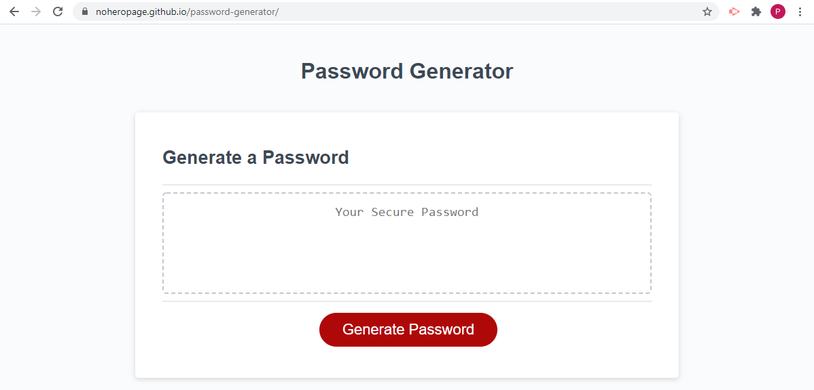
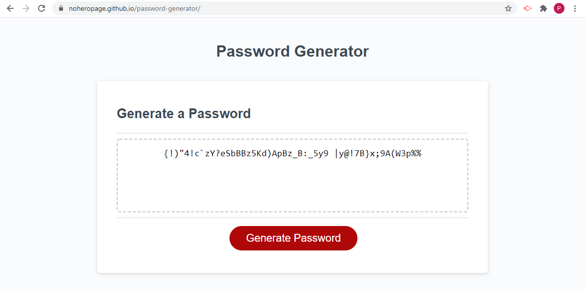

# Password-Generator
Goal: Using Javascript to create an application that generates a random password based on user input

## Description
Once the user clicks on the Generate Password button, some prompts will appear. First the user must enter a number equal to or greater than 8 while also equal to or less than 128. This tells the application how long the generated password should be. After entering a valid number the program prompts the user to select which types of characters should be included in this new password. The user can type in lowercase, uppercase, numeric, and special (capitalization in the input doesn't matter); but must choose at least one. Using these pieces of information the program generates a master list containing all the possible characters that could be part of the password and randomly selects a character until stopping at the user's desired password length. This is then displayed in the main textbox in the center of the page. 

## Screenshot

## Link
https://noheropage.github.io/password-generator/ 